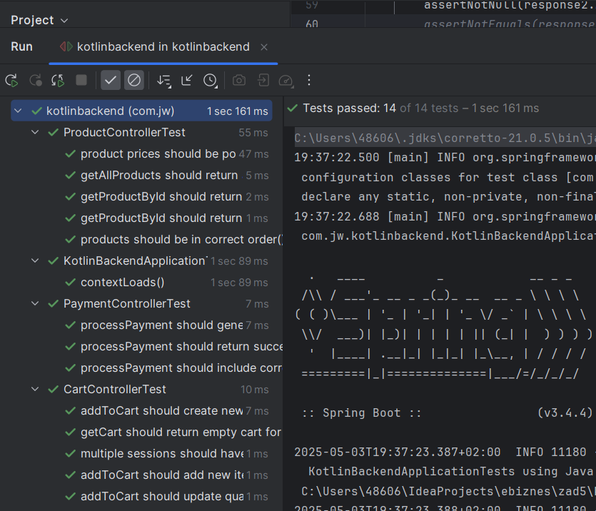

# Selenium and unit tests

### Selenium - frontend

Run tests:
```bash
pytest test_selenium.py -v
```
Output:
```
======================================================== test session starts =========================================================
platform win32 -- Python 3.11.9, pytest-8.3.5, pluggy-1.5.0 -- C:\Users\48606\AppData\Local\Microsoft\WindowsApps\PythonSoftwareFoundation.Python.3.11_qbz5n2kfra8p0\python.exe
cachedir: .pytest_cache
rootdir: C:\Users\48606\IdeaProjects\ebiznes\zad6
collected 14 items

test_selenium2.py::test_product_listing
DevTools listening on ws://127.0.0.1:55314/devtools/browser/411c918f-603d-4200-9ebf-101c8b3d5e04
PASSED                                                                                  [  7%]
test_selenium2.py::test_add_to_cart PASSED                                                                                      [ 14%]
test_selenium2.py::test_cart_empty_message PASSED                                                                               [ 21%]
test_selenium2.py::test_payment_form_fields_exist PASSED                                                                        [ 28%]
test_selenium2.py::test_fill_payment_form_and_submit PASSED                                                                     [ 35%]
test_selenium2.py::test_invalid_card_number PASSED                                                                              [ 42%]
test_selenium2.py::test_order_id_in_payment_response PASSED                                                                     [ 50%]
test_selenium2.py::test_payment_order_id_is_readonly PASSED                                                                     [ 57%]
test_selenium2.py::test_amount_editable PASSED                                                                                  [ 64%]
test_selenium2.py::test_card_holder_input_accepts_text PASSED                                                                   [ 71%]
test_selenium2.py::test_expiry_date_format PASSED                                                                               [ 78%]
test_selenium2.py::test_cvv_input_length PASSED                                                                                 [ 85%]
test_selenium2.py::test_page_title PASSED                                                                                       [ 92%]
test_selenium2.py::test_product_prices_format PASSED                                                                            [100%]

======================================================== 14 passed in 10.28s =========================================================
```

### Tests - backend
Tests are located in [zad5/kotlin-backend/src/test/kotlin/com/jw/kotlinbackend/controller](../zad5/kotlin-backend/src/test/kotlin/com/jw/kotlinbackend/controller) directory.

Tests run output:
